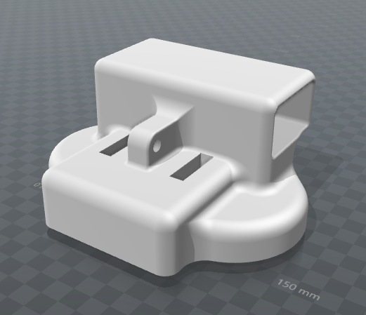
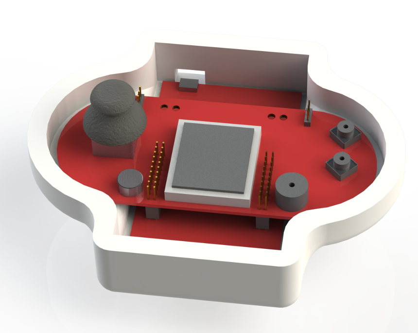
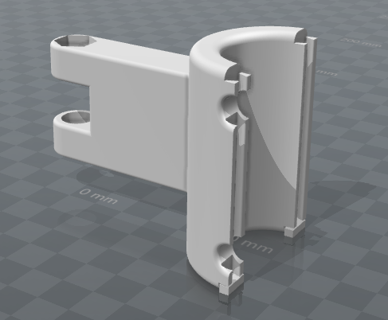
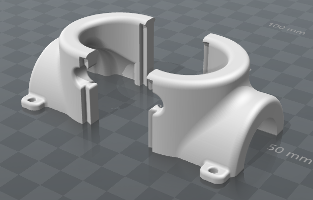
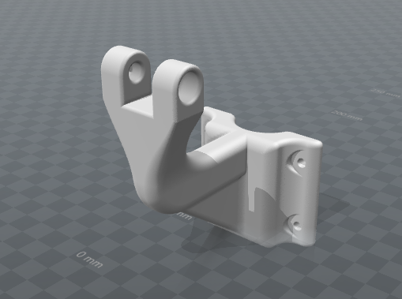
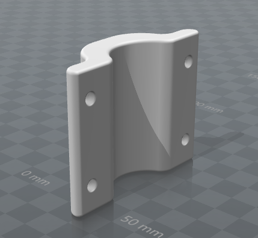

# eScooter Hardware
## PLEASE READ THIS GUIDE BEFORE YOU START PRINTING ANYTHING

There are 2 variations of this mounting assembly which will be referred to as version A and version B throughout this guide. We recommend using version A unless you are having trouble with the dovetail joints (the parts that slide tightly together).

## Version A

Version A consists of 4 parts:
* holder.STL
* t-top.STL
* t-left.STL
* t-right.STL

holder.STL should be printed face down as below. Be sure to **use** support material as this will certainly fail without. This part will most likely be very difficult to remove from the bed of the printer due to its high surface area.

Once everything is assembled, a square of velcro can be placed in the top of this part where the PCB rests. PCB fit is shown below.

t-top.STL should be printed in the following orientation. It will produce 1 usable part but actually has 3 separate parts as far as CURA (or any other STL viewer/slicer) is concerned. 2 of them are intended to act as specially made support for the primary part. Normal support material **must** also be used.

t-left.STL and t-right.STL are simply mirrors of eachother. They should be printed in the following orientation and support material **must** be used.

## Version B

The reason this version is included here is in case there are problems with the fit of version A's dovetail joints due to using different filaments or different printers. Instead of requiring tight tollerence plastic-plastic connections, this version instead relies on four bolts to clamp onto the scooter's vertical tube.

Version B consists of 3 parts:
* holder3.STL (refer to version A)
* arm3.STL
* clamp.STL

holder.STL should be made exactly as in version A.

arm.STL should be printed in the following orientation to minimize the risk of layer delamination causing catastrauphic failure in the clamping system. Also, be sure to **use** support material or the print will be likely to fail.

clamp.STL should be printed in the following orientation for the same reasons as arm.STL. Support material is **not needed** for this print.

